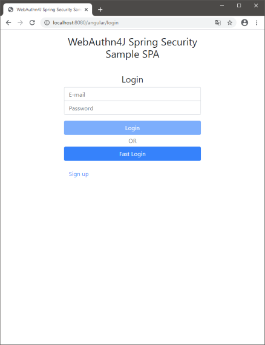

# WebAuthn4J Spring Security

[](https://github.com/webauthn4j/webauthn4j-spring-security/actions)
[](https://sonarcloud.io/dashboard?id=webauthn4j-spring-security)
[](https://github.com/webauthn4j/webauthn4j-spring-security/blob/master/LICENSE.txt)

WebAuthn4J Spring Security provides [Web Authentication specification](https://www.w3.org/TR/2019/REC-webauthn-1-20190304/) support for your Spring application by using [WebAuthn4J library](https://github.com/webauthn4j/webauthn4j).
Users can login with WebAuthn compliant authenticator.

## Project status

This project is under active development. API signature may change.

## Documentation

You can find out more details from the [reference](https://webauthn4j.github.io/webauthn4j-spring-security/en/).

## Build

WebAuthn4J Spring Security uses a Gradle based build system.
In the instructions below, `gradlew` is invoked from the root of the source tree and serves as a cross-platform,
self-contained bootstrap mechanism for the build.

### Prerequisites

- Java8 or later
- Spring Framework 5.0 or later

### Checkout sources

```
git clone https://github.com/webauthn4j/webauthn4j-spring-security
```

### Build all jars

```
./gradlew build
```

### Execute sample application

```
./gradlew samples:spa:bootRun
```




## License

WebAuthn4J Spring Security is Open Source software released under the
[Apache 2.0 license](http://www.apache.org/licenses/LICENSE-2.0.html).
